<div align="center">

# truthtrace — Grounded Fact-Check Retrieval

**truthtrace is a retrieval-augmented fact-checker for political claims. It takes a claim through these steps to a cited verdict or an honest `Can't verify`:**

`ingest` → `index` → `retrieve` → `rerank` → `match` → `judge` → `cite or abstain`.


**[Summary](#1-summary)** ·
**[Workflow](#4-the-end-to-end-workflow)** ·
**[Run it](#16-how-to-run-truthtrace)** ·
**[Configuration](#164-environment-variables)** ·
**[Known problems](#19-known-problems)** ·
**[Glossary](#21-glossary)**

</div>

> [!NOTE]
> This README uses ASD-STE100 Simplified Technical English. The writing rules and the project
> vocabulary are in [`docs/ste-style-guide.md`](docs/ste-style-guide.md). Each term in the
> [Glossary](#21-glossary) has only one meaning.

---

truthtrace finds the professional fact-checks that address a claim and returns their verdict with
citations. The main idea is that the verdict comes from a fact-checker, not from the model. A direct
match gives the rating of the fact-checker. An optional LLM must cite the retrieved evidence, and
truthtrace refuses its output if the citations are wrong. If the evidence is weak, truthtrace says
`Can't verify` and shows the related fact-checks.

This README is the **one location that explains all of truthtrace**. It gives these topics:

- the general design
- each stage and its procedure, step by step
- the decision rules and the safety model
- the data map
- the runbook
- the validation results and the known problems

| If you are… | Read |
|---|---|
| A manager or reviewer | [1](#1-summary), [3](#3-design-rules), [4](#4-the-end-to-end-workflow), [18](#18-validation-results), [20](#20-key-points) |
| A developer who joins the project | All sections, in sequence. Keep [16](#16-how-to-run-truthtrace) and [19](#19-known-problems) open while you work |
| An operator who runs truthtrace | [16](#16-how-to-run-truthtrace), [5](#5-the-ingestion-stage), [13](#13-the-front-ends), then the section for the stage that you examine |

---

## Table of contents

1. 🧭 [Summary](#1-summary)
2. 🏗️ [How truthtrace is built](#2-how-truthtrace-is-built)
   - 2.1 [Components](#21-components)
   - 2.2 [System context](#22-system-context)
   - 2.3 [Repository layout](#23-repository-layout)
3. 🛡️ [Design rules](#3-design-rules)
4. 🔄 [The end-to-end workflow](#4-the-end-to-end-workflow)
   - 4.1 [Full flow](#41-full-flow)
   - 4.2 [The life cycle of one claim](#42-the-life-cycle-of-one-claim)
   - 4.3 [Who does which step](#43-who-does-which-step)
5. 🔵 [The ingestion stage](#5-the-ingestion-stage)
6. 🟢 [The import stage](#6-the-import-stage)
7. 🟣 [The store](#7-the-store)
8. 🟠 [The index stage](#8-the-index-stage)
9. 🟡 [The retrieval stage](#9-the-retrieval-stage)
10. 🔴 [The verifier](#10-the-verifier)
11. 🟤 [The LLM providers](#11-the-llm-providers)
12. 🧪 [The evaluation harness](#12-the-evaluation-harness)
13. 🖥️ [The front-ends](#13-the-front-ends)
    - 13.1 [The CLI](#131-the-cli) · 13.2 [The Streamlit UI and the chat session](#132-the-streamlit-ui-and-the-chat-session)
14. ⚖️ [The decision and safety model](#14-the-decision-and-safety-model)
15. 🗂️ [Data and file map](#15-data-and-file-map)
16. ▶️ [How to run truthtrace](#16-how-to-run-truthtrace)
    - 16.1 [Prerequisites](#161-prerequisites) · 16.2 [Installation](#162-installation) · 16.3 [Run truthtrace](#163-run-truthtrace) · 16.4 [Environment variables](#164-environment-variables)
17. 🧩 [How to extend truthtrace](#17-how-to-extend-truthtrace)
18. ✅ [Validation results](#18-validation-results)
19. ⚠️ [Known problems](#19-known-problems)
20. 📌 [Key points](#20-key-points)
21. 📖 [Glossary](#21-glossary)
22. 📄 [License](#22-license)

---

## 1. Summary

**The problem.** A chat model can give a confident verdict on a political claim with no source. These
are the difficult questions:

- Which professional fact-checks address this claim?
- Does a fact-check rate this exact claim, or only a similar one with a different number or a "not"?
- Do two close fact-checks disagree?
- Did the model cite evidence that truthtrace retrieved?
- When must the tool say `Can't verify`?

truthtrace gives each of these questions its own stage or rule. The tool never shows a percentage
of truth.

| Item | Value |
|---|---|
| Input | A claim or a question in plain English |
| Output | A label on a fixed scale, a method, a rationale, citations (`E1`, `E2`…), the evidence and notes |
| Stages | **5**: ingestion (or import), index, retrieval, verifier, evaluation |
| Sources | PolitiFact and FactCheck.org feeds, plus `.jsonl` and `.csv` files |
| Providers | LLM: `none` (default), `fake`, `gemini`, `openai`. Embedder: `hashing` or sentence-transformers. Reranker: `lexical` or a cross-encoder |
| Offline mode | `truthtrace demo` loads 10 fictional fact-checks and uses `FakeLLM`. It needs no key and no network |
| Safety | A verdict needs a close match or validated LLM citations. Otherwise truthtrace abstains |
| Tests | **68** unit and end-to-end tests (`pytest`), all offline |

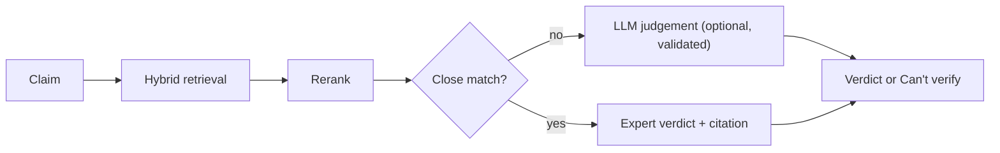

---

## 2. How truthtrace is built

### 2.1 Components

| Component | Module | Purpose |
|---|---|---|
| Settings | `src/truthtrace/config.py` | Read and validate the 18 environment variables. Load `.env` if it exists |
| Data objects | `src/truthtrace/models.py` | `Article`, `Evidence`, `VerificationResult` |
| Verdict scale | `src/truthtrace/labels.py` | The 7 labels, their display names, coarse groups and rating aliases |
| Text and dates | `src/truthtrace/text.py`, `dates.py` | Tokens, stems, negations, numbers, content hash, body windows, date formats |
| Polite fetcher | `src/truthtrace/sources/http.py` | robots.txt, honest user agent, delay for each host, retries |
| Feed parser | `src/truthtrace/sources/rss.py` | RSS 2.0 and Atom, with a tolerant RSS fallback |
| HTML helpers | `src/truthtrace/sources/html.py` | JSON-LD, meta tags, headings and container text with the standard library |
| Source adapters | `src/truthtrace/sources/politifact.py`, `factcheck_org.py` | Feed URLs, article URL patterns and page parsers |
| File import | `src/truthtrace/sources/records.py` | `.jsonl` and `.csv` rows to `Article` objects |
| Store | `src/truthtrace/storage.py` | SQLite tables `articles`, `chunks` and `meta` |
| Indexer | `src/truthtrace/indexing.py` | Claim cards, body windows and vector sync |
| Embedders | `src/truthtrace/embeddings.py` | Hashing embedder and sentence-transformers |
| BM25 | `src/truthtrace/bm25.py` | Okapi BM25 in pure Python |
| Rerankers | `src/truthtrace/rerank.py` | Lexical reranker and cross-encoder |
| Retriever | `src/truthtrace/retrieval.py` | BM25 and dense rankings, reciprocal rank fusion, one result for each article |
| LLM providers | `src/truthtrace/llm.py` | Gemini, OpenAI and the offline `FakeLLM` |
| Verifier | `src/truthtrace/verify.py` | Claim or question, match rules, LLM validation, abstention |
| Ingestion | `src/truthtrace/ingest.py` | Ingestion runs, file import and the schedule loop |
| Evaluation | `src/truthtrace/evaluation.py` | Time split, LIAR loader and metrics |
| Chat session | `src/truthtrace/chat.py` | Bounded history for each session |
| Runtime wiring | `src/truthtrace/runtime.py` | Build all services once from the settings |
| CLI | `src/truthtrace/cli.py` | The `truthtrace` command with 8 subcommands |
| Streamlit UI | `src/truthtrace/ui/streamlit_app.py` | Chat with evidence cards |

The component map shows which module calls which module. An arrow points from the caller to the module that it uses.

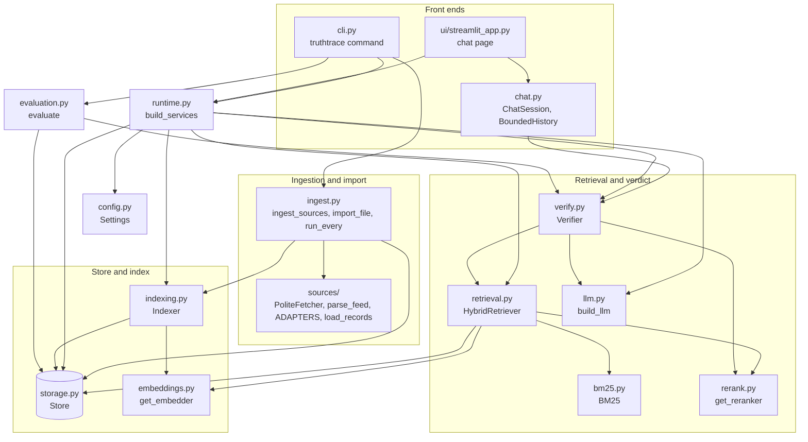

### 2.2 System context

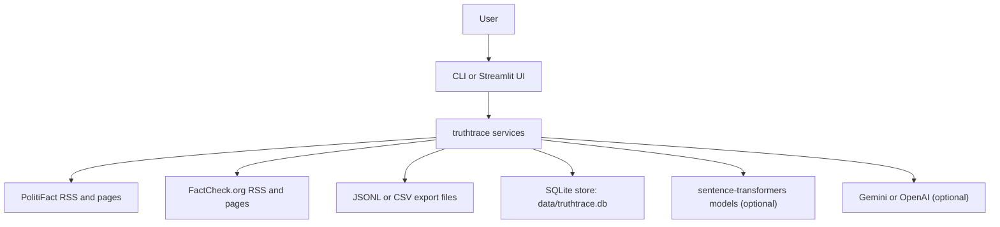

### 2.3 Repository layout

```
truthtrace/
├── .github/workflows/ci.yml     # CI: pip install -e ".[dev]" and pytest -q on Python 3.11
├── docs/ste-style-guide.md      # ASD-STE100 rules and the project vocabulary
├── src/truthtrace/
│   ├── config.py                # Settings from the environment, .env is optional
│   ├── models.py                # Article, Evidence, VerificationResult
│   ├── labels.py                # Label enum, display names, coarse groups, rating aliases
│   ├── text.py, dates.py        # Text helpers and date parser
│   ├── errors.py                # TruthTraceError and its 5 subclasses
│   ├── sources/                 # http.py, rss.py, html.py, politifact.py, factcheck_org.py, records.py
│   ├── storage.py               # SQLite store
│   ├── indexing.py              # Chunks and vectors
│   ├── embeddings.py, bm25.py, rerank.py, retrieval.py
│   ├── llm.py                   # Gemini, OpenAI, FakeLLM
│   ├── verify.py                # The verifier
│   ├── ingest.py                # Ingestion, import, schedule
│   ├── evaluation.py            # Metrics
│   ├── chat.py                  # ChatSession and BoundedHistory
│   ├── runtime.py               # build_services()
│   ├── cli.py                   # truthtrace {ingest,import,index,check,eval,stats,demo,ui}
│   ├── prompts/                 # judge_system.txt, judge_user.txt, answer_system.txt, answer_user.txt
│   ├── ui/streamlit_app.py      # Streamlit chat UI
│   └── demo/factchecks.jsonl    # 10 fictional fact-checks for the offline demo
├── tests/                       # 6 test files, 68 tests, no network
├── .env.example                 # The 18 variable names, with empty values
├── pyproject.toml               # Package metadata, 8 optional extras, pytest settings
└── LICENSE                      # MIT
```

---

## 3. Design rules

### 3.1 The fact-checker gives the verdict
A claim gets a rating directly only from a fact-check whose claim is a close match (`verify.py`). An
LLM verdict must cite the retrieved evidence. truthtrace never invents a confidence value or a
percentage of truth (`labels.py`).

### 3.2 Abstention is a correct answer
If no evidence passes the relevance threshold, or the LLM output fails validation, the label is
`unverifiable` and the method is `abstained`. truthtrace then shows the related fact-checks. `Can't verify` means "no fact-check found". It does not mean "true" or "false".

### 3.3 Idempotent storage
Articles are unique by URL and carry a content hash (`storage.py`). Chunks have a stable ID. A second
ingestion run or a second `truthtrace index` writes nothing new if nothing changed. There are no pickle files.

### 3.4 Polite ingestion
The polite fetcher reads robots.txt, sends an honest user agent and waits at least 2 seconds between
two requests to one host (`sources/http.py`). Ingestion fetches only new URLs, with a page limit for
each run. The schedule loop refuses an interval shorter than one hour (`ingest.py`).

### 3.5 Optional dependencies
The core package has no third-party dependency (`dependencies = []`). SQLite, BM25, HTML parsing, RSS
parsing and the hashing embedder use the standard library. Models, LLM clients, numpy and Streamlit
are extras.

### 3.6 One load for each model
`get_embedder()` and `get_reranker()` are cached (`lru_cache`). The retriever keeps its BM25 and vector
data in memory and loads them again only when the index version changes (`retrieval.py`).

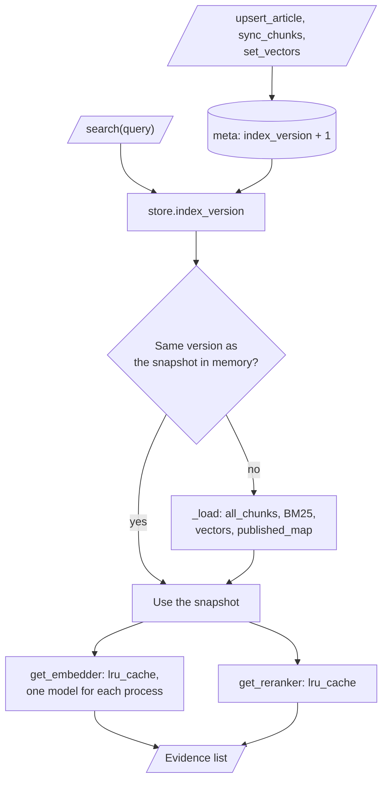

---

## 4. The end-to-end workflow

### 4.1 Full flow

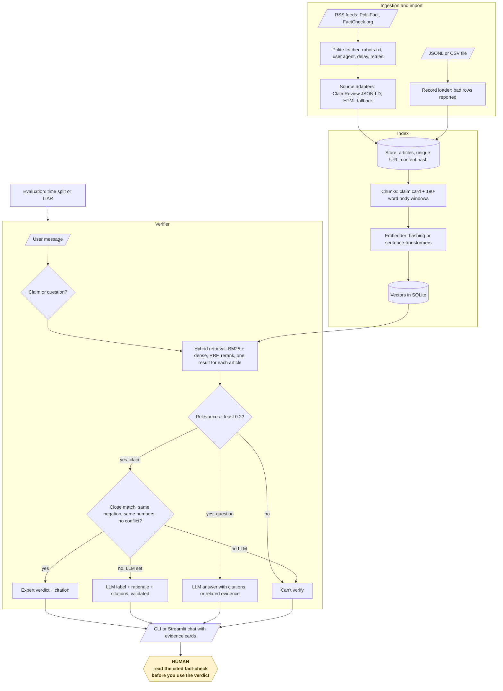

### 4.2 The life cycle of one claim

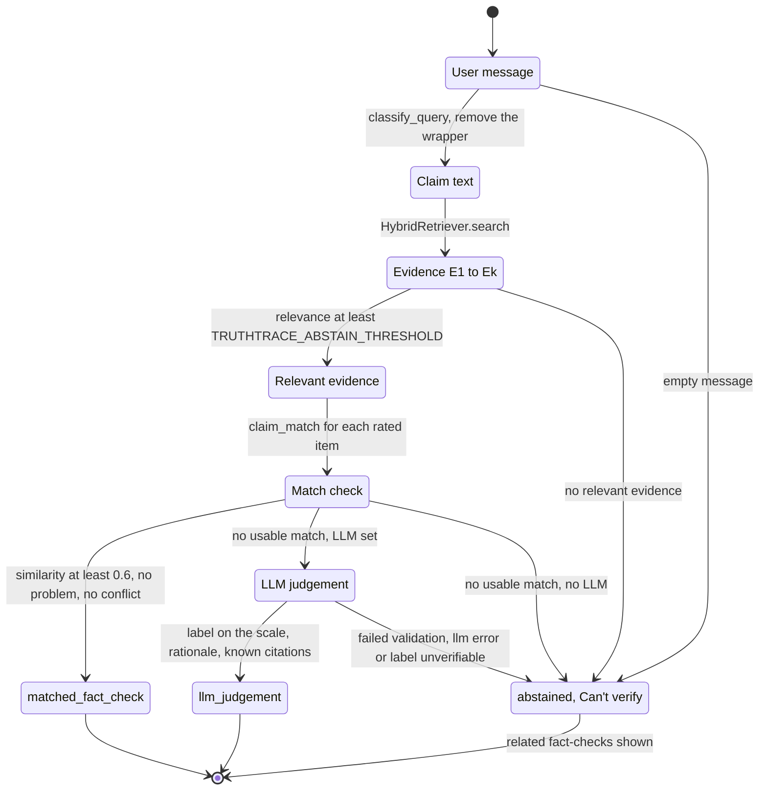

1. The ingestion stage or the import stage stores the fact-checks in the store.
2. The index stage makes the chunks and their vectors.
3. A user writes a message in the CLI (`truthtrace check`) or in the Streamlit UI.
4. The verifier decides if the message is a claim or a question, and removes a claim wrapper.
5. The retriever returns up to `TRUTHTRACE_TOP_K` fact-checks, each with a relevance from 0 to 1.
6. If no relevance reaches `TRUTHTRACE_ABSTAIN_THRESHOLD`, truthtrace abstains.
7. For a claim, the verifier compares the claim with each rated fact-check.
8. If a close match passes all rules, truthtrace returns the rating of that fact-check.
9. Otherwise, if an LLM is set, the LLM judges the claim and truthtrace validates the output.
10. Otherwise, truthtrace abstains and shows the related fact-checks.

### 4.3 Who does which step

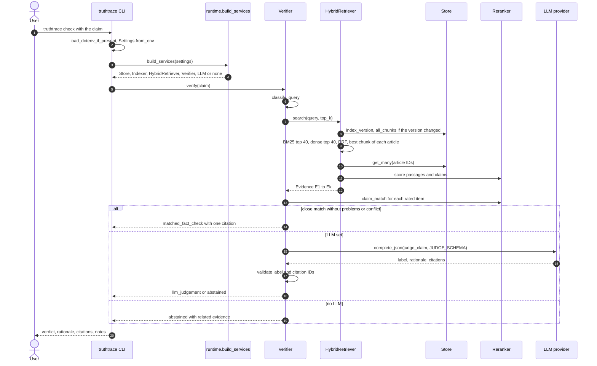

---

## 5. The ingestion stage

**Purpose.** Get new fact-checks from the feeds of the fact-checkers and store them (`ingest_sources()` in `ingest.py`).

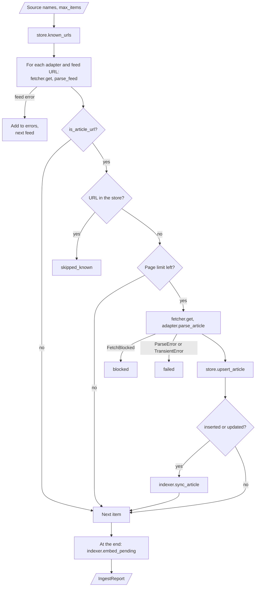

| Input | Output |
|---|---|
| The source names (`politifact`, `factcheck.org` or `all`) | New or updated rows in the `articles` table, and their chunks |
| `TRUTHTRACE_MAX_ITEMS` or `--max-items` | An `IngestReport`: `discovered`, `skipped_known`, `fetched`, `inserted`, `updated`, `unchanged`, `blocked`, `failed`, `errors` |

**Procedure**

1. Read the known URLs from the store.
2. For each source adapter, fetch each feed URL with the polite fetcher.
3. Parse the feed. If the feed is not well-formed XML, read its `<item>` blocks with the tolerant fallback.
4. Keep only the URLs that fit the article URL pattern of the source adapter.
5. Skip each URL that is in the store. Stop the fetch when the page limit for this run is used.
6. Fetch the page and parse it into an `Article`. If the page has no date, use the date of the feed item.
7. Upsert the article. If it is new or changed, sync its chunks.
8. At the end, embed all chunks that do not have a vector for the current embedder.

**Source adapters**

| Source | Feed | Article URL pattern | Fields |
|---|---|---|---|
| `politifact` | `https://www.politifact.com/rss/factchecks/` | `https://[www.]politifact.com/factchecks/YYYY/mon/D/<speaker>/<slug>/` | Claim, speaker, rating and date from `ClaimReview` JSON-LD. HTML fallback for the `m-statement` layout and the 2026 `pf-statement` layout. Body from `m-textblock` |
| `factcheck.org` | `https://www.factcheck.org/feed/` | `https://www.factcheck.org/YYYY/MM/<slug>/` | Title, body from `entry-content`, date, summary. Claim and rating only if the page has `ClaimReview` JSON-LD |

The PolitiFact adapter reads each field from JSON-LD first and from the HTML layouts second:

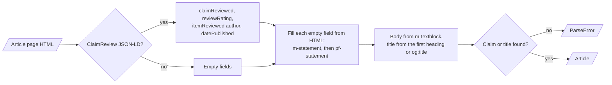

**Polite fetcher rules** (`PoliteFetcher` in `sources/http.py`)

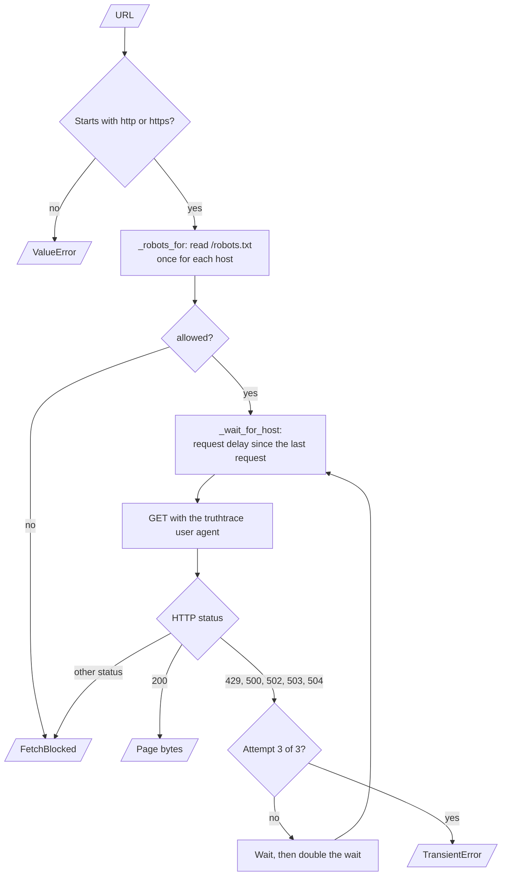

- The user agent is `truthtrace/0.1 (+<TRUTHTRACE_CONTACT_URL>)`. A user agent that contains `Mozilla` causes an error.
- The fetcher reads `/robots.txt` once for each host. HTTP 200: obey it. HTTP 4xx: all paths are permitted. Other results: no path is permitted.
- The fetcher waits `TRUTHTRACE_REQUEST_DELAY` seconds (minimum 2, default 5) between two requests to one host.
- HTTP 429, 500, 502, 503 and 504 cause a retry. The fetcher makes 3 attempts. The wait starts at the request delay and doubles.
- Any other status that is not 200 causes `FetchBlocked`. The report counts it as `blocked`.
- A URL that does not start with `http://` or `https://` causes an error.

**Rules**

- A feed error goes to `errors`, and the run continues with the next feed.
- A page that cannot be parsed counts as `failed`. The run continues.
- `truthtrace ingest --every N` repeats the run each N hours. `--every` without N uses `TRUTHTRACE_INGEST_INTERVAL_HOURS`. The minimum is 1 hour.
- A failed scheduled run is logged. The schedule continues.

---

## 6. The import stage

**Purpose.** Load fact-checks from an export file (`import_file()` in `ingest.py`, `load_records()` in `sources/records.py`).

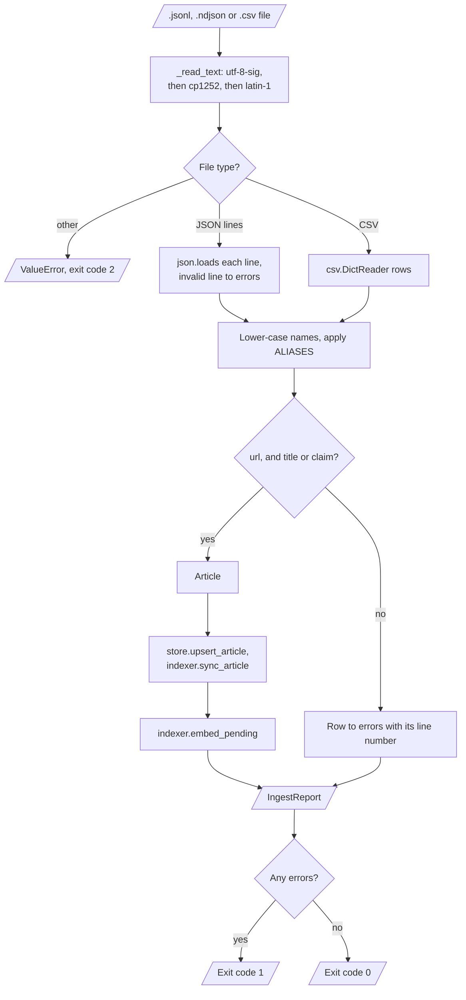

| Input | Output |
|---|---|
| A `.jsonl`, `.ndjson` or `.csv` file | New or updated articles and their chunks |
| `--source` (default `import`) | An `IngestReport` with the bad rows in `errors` |

**Procedure**

1. Read the file. Try the encodings `utf-8-sig`, `cp1252` and `latin-1`, in that sequence.
2. Read each JSON line or each CSV row. Record each invalid JSON line with its line number.
3. Change the column names to lower case and apply the aliases (see the table).
4. Refuse a row without `url`, or without both `title` and `claim`.
5. Upsert each good row and sync its chunks.
6. Embed the chunks without a vector.

**Column aliases**

| Column in the file | Field |
|---|---|
| `date`, `date published`, `date_published` | `published` |
| `statement` | `claim` |
| `author` | `speaker` |
| `verdict`, `label` | `rating` |
| `description` | `summary` |
| `link` | `url` |

**Rules**

- A bad row never stops the import. The CLI exits with code `1` if one or more rows failed.
- If a row has no `title`, the claim becomes the title.
- If a row has no `source`, the value of `--source` is used.

---

## 7. The store

**Purpose.** Keep all fact-checks, chunks and vectors in one SQLite file (`Store` in `storage.py`).

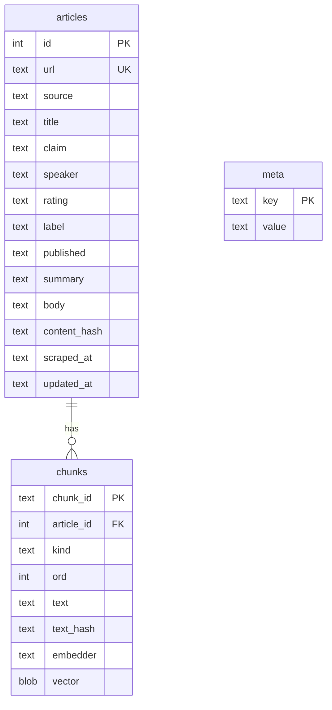

| Table | Key | Columns |
|---|---|---|
| `articles` | `id`, `url` (unique) | `source`, `title`, `claim`, `speaker`, `rating`, `label`, `published`, `summary`, `body`, `content_hash`, `scraped_at`, `updated_at` |
| `chunks` | `chunk_id` | `article_id` (cascade delete), `kind` (`claim` or `body`), `ord`, `text`, `text_hash`, `embedder`, `vector` |
| `meta` | `key` | `index_version` |

**Upsert procedure** (`upsert_article()`)

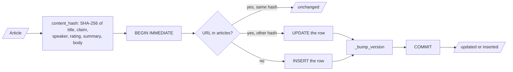

1. Calculate the SHA-256 content hash of title, claim, speaker, rating, summary and body.
2. If the URL exists with the same hash, return `unchanged`.
3. If the URL exists with a different hash, update the row and return `updated`.
4. Otherwise, insert the row and return `inserted`.
5. After each insert or update, increase the index version.

**Rules**

- A file database uses WAL mode, so a reader never sees a half-written index.
- Each write is one `BEGIN IMMEDIATE` transaction. An error causes a rollback.
- Foreign keys are on. A deleted article deletes its chunks.
- The store saves the label from the rating, and the date in ISO format.

---

## 8. The index stage

**Purpose.** Make the chunks of each fact-check and keep their vectors current (`Indexer` in `indexing.py`).

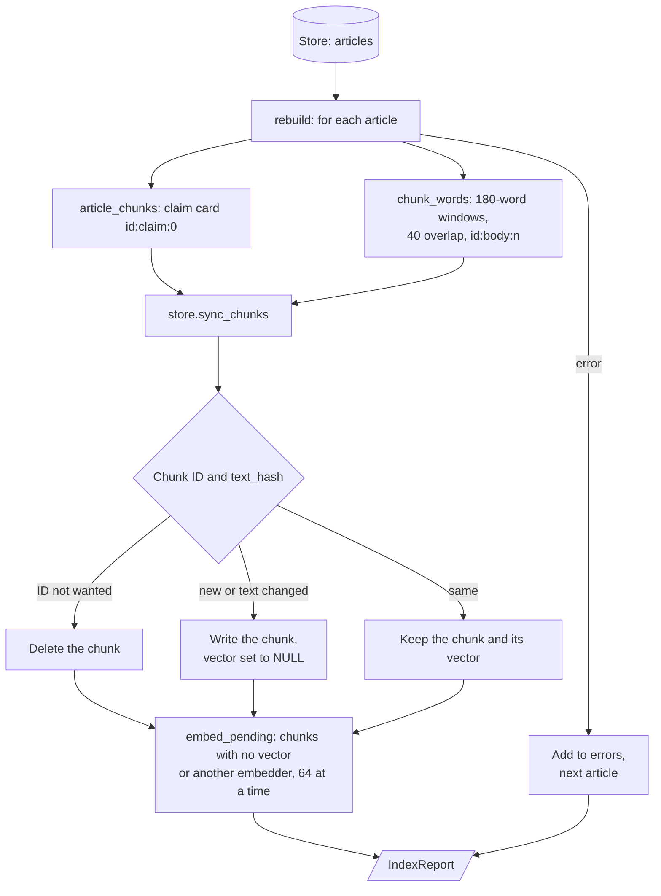

| Input | Output |
|---|---|
| The articles in the store | Rows in the `chunks` table with a vector for the current embedder |
| `TRUTHTRACE_CHUNK_WORDS`, `TRUTHTRACE_CHUNK_OVERLAP`, `TRUTHTRACE_EMBEDDER` | An `IndexReport`: `articles`, `chunks_changed`, `chunks_removed`, `embedded`, `errors` |

**Procedure** (`truthtrace index` calls `rebuild()`)

1. For each article, make the claim card `<id>:claim:0`: title, `Claim:`, `Speaker:`, `Rating:` and summary.
2. Split the body into windows of 180 words with 40 words of overlap. Put the title before each window. The IDs are `<id>:body:<n>`.
3. Sync the chunks: delete the old IDs, write the new or changed chunks and remove their vectors.
4. Keep each unchanged chunk and its vector.
5. If one article fails, record the error and continue with the next article.
6. Embed all chunks that have no vector, or a vector from a different embedder, in batches of 64.

**Embedders** (`embeddings.py`)

| Setting | Embedder | Notes |
|---|---|---|
| `hashing` (default) or `hashing:<dim>` | `HashingEmbedder`, 512 dimensions | Signed feature hashing of stemmed words and word pairs. No synonyms. No dependency |
| `sentence-transformers:<model>` | `SentenceTransformerEmbedder` | For example `BAAI/bge-small-en-v1.5`. Needs the `[embeddings]` extra |

**Rules**

- A body window of 180 words stays below the 256-token limit of small encoders, so no text is cut off.
- After you change `TRUTHTRACE_EMBEDDER`, run `truthtrace index`. The index stage embeds all chunks again.
- `TRUTHTRACE_CHUNK_OVERLAP` must be smaller than `TRUTHTRACE_CHUNK_WORDS`.

---

## 9. The retrieval stage

**Purpose.** Find the best fact-checks for a query (`HybridRetriever.search()` in `retrieval.py`).

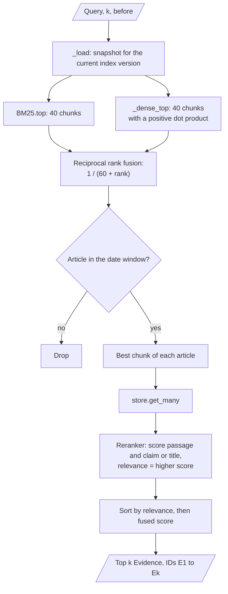

| Input | Output |
|---|---|
| The query, `k` (`TRUTHTRACE_TOP_K`) and an optional date window | Up to `k` `Evidence` items, one for each article, with IDs `E1`, `E2`… |

**Procedure**

1. If the index version changed, load all chunks, the BM25 data and the vectors into memory again.
2. Get the top 40 chunks from BM25 (`k1 = 1.5`, `b = 0.75`).
3. Embed the query and get the top 40 chunks with a positive dot product.
4. Fuse the two rankings with reciprocal rank fusion. Each ranking adds `1 / (60 + rank)` to a chunk, and rank 1 is the best.
5. Keep the best chunk of each article. Remove articles outside the date window.
6. Rerank each candidate against its passage and against its claim (or its title). Keep the higher score as the relevance.
7. Sort by relevance, then by fused score. Return the top `k` items.

**Rerankers** (`rerank.py`)

| Setting | Reranker | Score |
|---|---|---|
| `lexical` (default) | `LexicalReranker` | F2 overlap of stemmed content words and word pairs, from 0 to 1. Recall counts more than precision |
| `cross-encoder:<model>` | `CrossEncoderReranker` | Sigmoid of the cross-encoder score. Needs the `[embeddings]` extra |

**Rules**

- The date window `before` excludes articles without a date. The evaluation uses it.
- A chunk without a vector for the current embedder takes part in BM25 only.
- If numpy is installed (`[fast]` extra), the dot products use numpy.

---

## 10. The verifier

**Purpose.** Give a claim a verdict, give a question an answer, or abstain (`Verifier.verify()` in `verify.py`).

| Input | Output |
|---|---|
| A user message, an optional chat history and an optional date window | A `VerificationResult`: `query`, `mode`, `label`, `method`, `rationale`, `citations`, `evidence`, `notes` |

**Procedure: claim or question** (`classify_query()`)

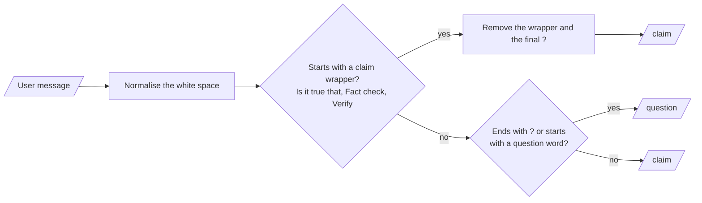

1. Look for a claim wrapper at the start: `Is it true that`, `Is it correct that`, `Is it accurate that`, `Fact check`, `True or false`, `Verify`, `Check` or `Claim`.
2. If there is a wrapper, the message is a claim. Remove the wrapper and the final "?".
3. Otherwise, if the message ends with "?" or starts with a question word (who, what, is, does, can…), it is a question.
4. Otherwise, it is a claim.

**Procedure: claim**

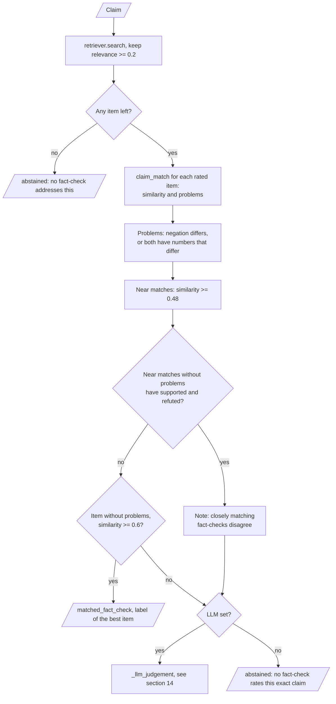

1. Retrieve the evidence. Keep only the items with a relevance of at least `TRUTHTRACE_ABSTAIN_THRESHOLD` (0.2).
2. If no item remains, abstain: "I couldn't find a fact-check that addresses this."
3. For each kept item with a label, calculate the similarity between the user claim and the checked claim.
4. Find the problems: one statement has a negation and the other does not, or both have numbers and the numbers differ.
5. An item with a similarity of at least 0.8 × `TRUTHTRACE_MATCH_THRESHOLD` is a near match. If the near matches without problems include `supported` and `refuted` labels, there is a conflict.
6. If an item without problems has a similarity of at least `TRUTHTRACE_MATCH_THRESHOLD` (0.6) and there is no conflict, return its label. The method is `matched_fact_check`.
7. Otherwise, if an LLM is set, judge the claim with the LLM and validate the output (see [Section 14](#14-the-decision-and-safety-model)).
8. Otherwise, abstain: "No fact-check rates this exact claim."

**Procedure: question**

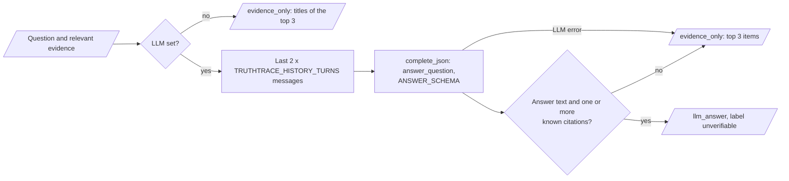

1. Retrieve and filter the evidence as for a claim.
2. If no LLM is set, return the titles of the top 3 items. The method is `evidence_only`.
3. Otherwise, send the question, the evidence and the last `2 × TRUTHTRACE_HISTORY_TURNS` chat messages to the LLM.
4. If the answer has no text or no valid citation, return the top 3 items. The method is `evidence_only`.
5. Otherwise, return the answer with its citations. The method is `llm_answer`. The label stays `unverifiable`.

**Rules**

- The matched verdict text names the fact-checker, the speaker, the rating, the date and the checked claim.
- Each note explains a decision, for example `E1 looks similar but one statement is negated and the other is not`.
- An LLM error never fails the request. For a claim, truthtrace abstains with the note `llm error`. For a question, truthtrace returns the top 3 items with the method `evidence_only`.

---

## 11. The LLM providers

**Purpose.** Give the verifier one small interface to a language model (`llm.py`).

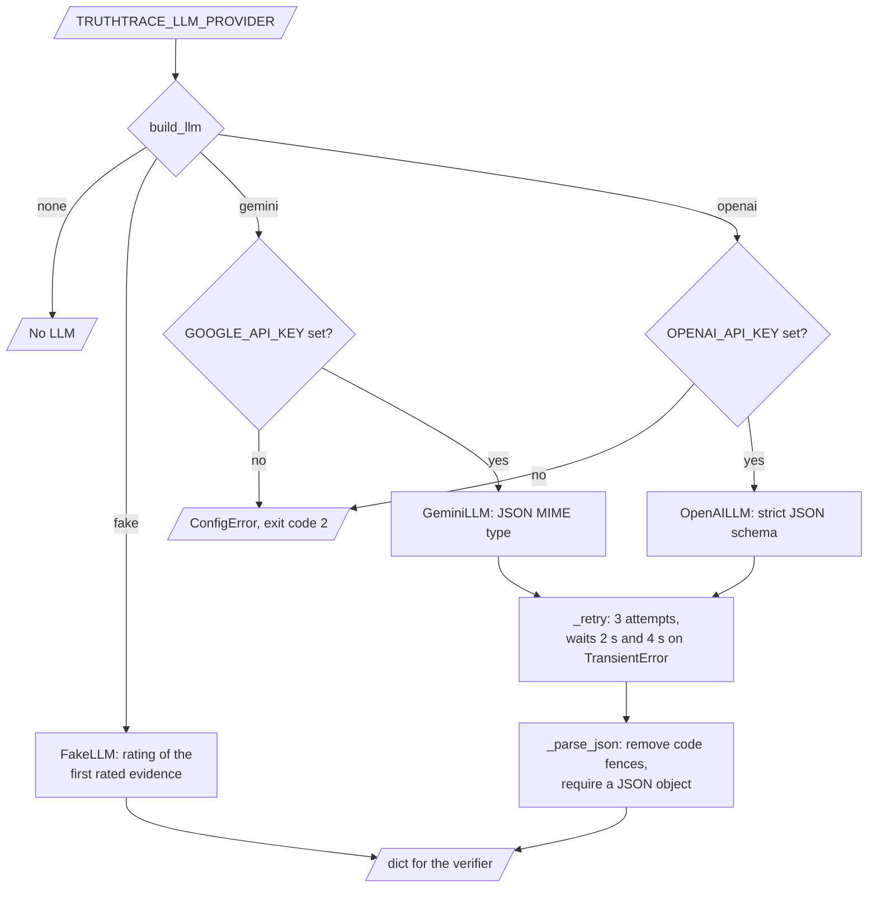

| Provider | Class | Default model | Output control |
|---|---|---|---|
| `none` (default) | none | none | No LLM. Verdicts come only from matches |
| `fake` | `FakeLLM` | `fake` | Deterministic. It copies the rating of the first rated evidence and cites it |
| `gemini` | `GeminiLLM` | `gemini-2.0-flash` | JSON MIME type, temperature 0. Needs `GOOGLE_API_KEY` and the `[gemini]` extra |
| `openai` | `OpenAILLM` | `gpt-4o-mini` | Strict JSON schema, temperature 0. Needs `OPENAI_API_KEY` and the `[openai]` extra |

**Rules**

- `TRUTHTRACE_LLM_MODEL` replaces the default model.
- Each call has a limit of 800 output tokens.
- A transient error causes a retry. There are 3 attempts, with waits of 2 and 4 seconds.
- For OpenAI, a rate limit, a connection error, a timeout or a server error is transient. For Gemini, an error text with `429`, `500`, `503`, `UNAVAILABLE` or `RESOURCE_EXHAUSTED` is transient.
- truthtrace removes Markdown code fences around the JSON before it parses the JSON.
- The log contains the task name and, for OpenAI, the completion token count. It does not contain the key.

---

## 12. The evaluation harness

**Purpose.** Measure the verdict quality, the abstention rate and the retrieval quality (`evaluation.py`).

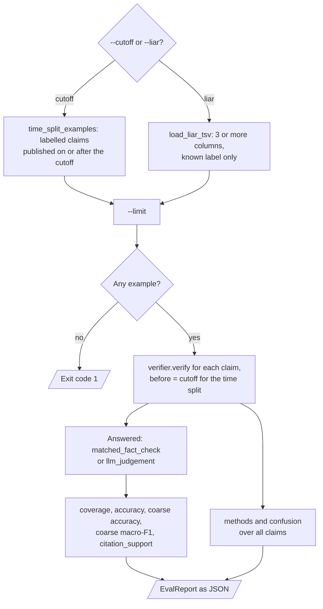

| Input | Output |
|---|---|
| `--cutoff YYYY-MM-DD` (time split) or `--liar FILE` (LIAR TSV), optional `--limit` | An `EvalReport` as JSON |

**Procedure: time split**

1. Take each stored article with a claim and a label, published on or after the cutoff, as a test claim.
2. Verify each test claim with `before = cutoff`. Retrieval sees only articles published before the cutoff.
3. Calculate the metrics.

**Procedure: LIAR**

1. Read each TSV row with at least 3 columns: ID, label, statement.
2. Map the label to the scale (`pants-fire`, `barely-true`…). Skip a row with an unknown label.
3. Verify each statement without a date window, and calculate the metrics.

**Metrics** (`EvalReport`)

| Metric | Meaning |
|---|---|
| `n` | Number of test claims |
| `coverage` | Fraction of claims with a verdict (`matched_fact_check` or `llm_judgement`) |
| `accuracy_answered` | Exact 6-label accuracy on the claims with a verdict |
| `coarse_accuracy_answered` | Accuracy on the coarse groups, on the claims with a verdict |
| `coarse_macro_f1_answered` | Macro-F1 over `supported`, `mixed`, `refuted` |
| `coarse_accuracy_overall` | Coarse accuracy over all claims. An abstention counts as wrong |
| `recall_at_k` | Fraction of claims with a known relevant URL in the top 5. `null` if no claim has a relevant URL. The time split and the LIAR loader give no relevant URLs, so the value is `null` at this time |
| `citation_support` | Fraction of verdicts whose citations are in the evidence and point in the same coarse direction |
| `methods` | Count of each method |
| `confusion` | Gold coarse group against predicted coarse group |

---

## 13. The front-ends

### 13.1 The CLI

**Purpose.** Run all stages from a terminal (`cli.py`). Put the global option `--db PATH` before the subcommand.

```mermaid
flowchart TD
    ARGS[/"truthtrace --db PATH subcommand"/] --> PARSE["build_parser, parse_args"]
    PARSE --> SET["_settings: .env if present,<br/>Settings.from_env, --db override"]
    SET --> CMD{"Subcommand"}
    CMD -- "ingest, import, index, stats" --> SVC1["build_services without the LLM"]
    CMD -- "check, eval" --> SVC2["build_services with the LLM from settings"]
    CMD -- "demo" --> DEMO["run_demo: data/demo.db,<br/>fake provider, import the demo file"]
    CMD -- "ui" --> UI["streamlit run ui/streamlit_app.py"]
    SVC1 --> OUT[/"JSON report or results"/]
    SVC2 --> OUT
    DEMO --> OUT
    SET -- "ConfigError" --> E2[/"error message, exit code 2"/]
    OUT -. "TruthTraceError or ValueError in a step" .-> E2
```

| Command | Options | What it does |
|---|---|---|
| `truthtrace ingest` | `--source {all,politifact,factcheck.org}`, `--max-items N`, `--every [N]` | One ingestion run, or a run each N hours |
| `truthtrace import <path>` | `--source NAME` (default `import`) | Import a `.jsonl`, `.ndjson` or `.csv` file |
| `truthtrace index` | none | Sync all chunks and embed the missing vectors. You can run it many times |
| `truthtrace check <claim>...` | `--json` | Verify one or more claims or questions |
| `truthtrace eval` | `--cutoff DATE` or `--liar FILE`, `--limit N` | Run the evaluation and print the report |
| `truthtrace stats` | none | Print `articles`, `chunks`, `index_version` and `db` |
| `truthtrace demo [claim...]` | none | Load the fictional fact-checks into `data/demo.db` and verify 5 demo claims (or yours) with `FakeLLM` |
| `truthtrace ui` | none | Start the Streamlit UI |

**Exit codes**

| Code | Meaning |
|---|---|
| `0` | The command succeeded |
| `1` | `import` had bad rows, or `eval` found no test claims |
| `2` | A setting, an argument or an input is not valid (`TruthTraceError` or `ValueError`) |

**Demo procedure** (`truthtrace demo`)

1. Open `data/demo.db` (or `--db`) with the default settings and the `fake` provider. The demo does not use the other environment variables.
2. Import `src/truthtrace/demo/factchecks.jsonl`. The import is idempotent.
3. Verify the 5 demo claims, or the claims that you give, and print each result.

### 13.2 The Streamlit UI and the chat session

**Purpose.** Check claims in a browser chat with evidence cards (`ui/streamlit_app.py`, `chat.py`, `[ui]` extra).

```mermaid
sequenceDiagram
    autonumber
    actor U as User
    participant UI as Streamlit page
    participant CS as ChatSession
    participant H as BoundedHistory
    participant VER as Verifier

    UI->>UI: services, cached: Settings.from_env, build_services
    UI->>CS: one ChatSession for each browser session
    U->>UI: claim or question in chat_input
    UI->>CS: send(message)
    CS->>H: messages, earlier turns only
    CS->>VER: verify(message, history)
    VER-->>CS: VerificationResult
    CS->>H: add user message and short assistant summary
    H->>H: keep 2 x history_turns messages and 4000 characters
    CS-->>UI: result
    UI-->>U: verdict badge, method, rationale, evidence cards, notes
```

1. Start the UI with `truthtrace ui`. The UI reads the settings and builds the services once for each process.
2. If the store is empty, the UI shows a warning. Run `truthtrace ingest` or `truthtrace import` first.
3. Write a claim or a question in the chat input.
4. Read the verdict badge (claims only), the method, the rationale and the evidence cards.
5. Open the linked fact-check to read the full reasoning.

**Rules**

- Each browser session has its own `ChatSession` with a `BoundedHistory`.
- The history keeps at most `2 × TRUTHTRACE_HISTORY_TURNS` messages and 4,000 characters.
- The current message goes to the verifier once. The history holds only earlier messages.
- To use the demo data in the UI, set `TRUTHTRACE_DB_PATH=data/demo.db`.

---

## 14. The decision and safety model

**Verdict scale** (`labels.py`)

| Label | Display | Coarse group | Source ratings that map to it |
|---|---|---|---|
| `true` | True | `supported` | `true` |
| `mostly_true` | Mostly true | `supported` | `mostly-true` |
| `half_true` | Half true | `mixed` | `half-true` |
| `mostly_false` | Mostly false | `refuted` | `mostly-false`, `barely-true` |
| `false` | False | `refuted` | `false` |
| `pants_on_fire` | Pants on fire | `refuted` | `pants-fire`, `pants on fire`, `Pants on Fire!` |
| `unverifiable` | `Can't verify` | `unverifiable` | `unverifiable`, `can't verify` |

Flip-O-Meter ratings (`full flop`, `half flip`, `no flip`) describe consistency, not truth. They get no label.

**Thresholds**

| Value | Default | Permitted | Effect |
|---|---|---|---|
| `TRUTHTRACE_ABSTAIN_THRESHOLD` | `0.2` | `0.0` to `1.0` | Evidence below this relevance is ignored |
| `TRUTHTRACE_MATCH_THRESHOLD` | `0.6` | `0.0` to `1.0` | Similarity for a direct verdict from a fact-check |
| Near-match limit | 0.8 × match threshold (`0.48`) | fixed | Similarity for conflict detection |
| `TRUTHTRACE_TOP_K` | `5` | `1` to `20` | Number of evidence items |

**Methods**

| Method | Mode | Label | When |
|---|---|---|---|
| `matched_fact_check` | claim | The rating of the fact-check | A close match without problems and without conflict |
| `llm_judgement` | claim | The LLM label | The LLM output passed validation |
| `llm_answer` | question | `unverifiable` | The LLM answered with valid citations |
| `evidence_only` | question | `unverifiable` | No LLM, an LLM error, or the LLM answer had no valid citation |
| `abstained` | claim or question | `unverifiable` | Low relevance, no match and no LLM, failed validation, an LLM error, or an empty message |

**LLM output validation** (`_llm_judgement()`)

```mermaid
flowchart TD
    IN[/"Claim and relevant evidence"/] --> CALL["complete_json: judge_claim,<br/>JUDGE_SCHEMA"]
    CALL -- "any exception" --> ERR[/"abstained, note llm error"/]
    CALL --> LAB["Parse the label, keep known citation IDs"]
    LAB --> UNK{"Unknown citation IDs?"}
    UNK -- "yes" --> DROP["Drop them, add a note"]
    UNK -- "no" --> CHK
    DROP --> CHK{"Label on the 7 values, rationale not empty,<br/>and citations for a label other than unverifiable?"}
    CHK -- "no" --> FAIL[/"abstained, note llm output failed validation"/]
    CHK -- "yes" --> UV{"Label unverifiable?"}
    UV -- "yes" --> AB[/"abstained"/]
    UV -- "no" --> OK[/"llm_judgement with citations"/]
```

| Check | Result if it fails |
|---|---|
| The label is one of the 7 values | Abstain with the note `llm output failed validation` |
| The rationale is not empty | Abstain with the same note |
| A label other than `unverifiable` has one or more known citations | Abstain with the same note |
| Each citation ID is in the evidence | truthtrace drops the unknown ID and adds a note |
| The label is `unverifiable` | The method becomes `abstained` |

**Safety rules**

| Rule | How the code enforces it |
|---|---|
| No secret in logs or `repr` | `google_api_key` and `openai_api_key` have `repr=False`. Logs show only the error type of an LLM failure |
| Honest crawling | User agent with a contact URL, robots.txt, 2-second minimum delay, page limit, 1-hour minimum interval |
| No duplicate data | Unique URL, content hash, stable chunk IDs |
| No half-written index | Transactions and WAL mode |
| No leak in evaluation | The time split searches only articles published before the cutoff |
| No percentage of truth | Only the 7 labels exist |

---

## 15. Data and file map

| Path | Committed? | Contents |
|---|---|---|
| `data/truthtrace.db` | No (git ignores `data/` and `*.db`) | The store: articles, chunks, vectors, index version |
| `data/truthtrace.db-wal`, `data/truthtrace.db-shm` | No | SQLite WAL files |
| `data/demo.db` | No | The demo store that `truthtrace demo` makes |
| `.env` | No (git ignores it) | Your local settings and credentials |
| `.env.example` | Yes | The 18 variable names, with empty values |
| `src/truthtrace/prompts/*.txt` | Yes | The 4 prompt templates |
| `src/truthtrace/demo/factchecks.jsonl` | Yes | 10 fictional fact-checks about invented places and people |
| `tests/` | Yes | Synthetic HTML, RSS and records written for the tests |

The `.gitignore` file also ignores `*.csv`, `*.tsv`, `*.pkl`, `*.index`, `*.sqlite`, `*.log` and `scraped_results/`.

---

## 16. How to run truthtrace

### 16.1 Prerequisites

| Need | For |
|---|---|
| Python 3.10+ | All components (CI uses Python 3.11) |
| Network access to `politifact.com` and `factcheck.org` | `truthtrace ingest` only |
| A Google or OpenAI API key | The `gemini` or `openai` provider only |

### 16.2 Installation

```bash
git clone https://github.com/KrishnaAnnavaram/truthtrace.git
cd truthtrace
python -m venv .venv
. .venv/bin/activate            # Windows: .venv\Scripts\activate
pip install -e ".[dev]"
```

The optional extras are in `pyproject.toml`:

| Extra | Installs | For |
|---|---|---|
| `embeddings` | `sentence-transformers>=2.6` | Dense embeddings and the cross-encoder reranker |
| `fast` | `numpy>=1.26` | Faster dot products |
| `gemini` | `google-genai>=1.0` | The `gemini` provider |
| `openai` | `openai>=1.40` | The `openai` provider |
| `ui` | `streamlit>=1.37` | `truthtrace ui` |
| `dotenv` | `python-dotenv>=1.0` | `.env` file loading |
| `all` | All of the above | Everything |
| `dev` | `pytest`, `ruff` | The tests |

### 16.3 Run truthtrace

Run the offline demo first. It needs no key and no network:

```bash
truthtrace demo
truthtrace demo "The Riverton bridge will be closed for two years"
# > The Riverton bridge will be closed for two years
#   verdict: False  [matched_fact_check]
```

Ingest real fact-checks and check a claim:

```bash
cp .env.example .env            # optional: provider, key, embedder
truthtrace ingest --max-items 30
truthtrace check "Crime is at an all-time high"
truthtrace check --json "Is it true that the minimum wage rose?"
truthtrace stats
```

Use better models (optional):

```bash
pip install -e ".[embeddings,gemini,dotenv]"
# in .env:
#   TRUTHTRACE_EMBEDDER=sentence-transformers:BAAI/bge-small-en-v1.5
#   TRUTHTRACE_RERANKER=cross-encoder:cross-encoder/ms-marco-MiniLM-L-6-v2
#   TRUTHTRACE_LLM_PROVIDER=gemini
#   GOOGLE_API_KEY=...
truthtrace index                # embed all chunks again with the new embedder
```

Import a file, evaluate and start the UI:

```bash
truthtrace import export.jsonl --source myexport
truthtrace eval --cutoff 2025-01-01
truthtrace eval --liar test.tsv --limit 500
truthtrace ingest --every       # repeat each TRUTHTRACE_INGEST_INTERVAL_HOURS (default 24)
pip install -e ".[ui]"
truthtrace ui
```

Run the tests:

```bash
pytest -q
```

### 16.4 Environment variables

| Variable | Used by | Meaning |
|---|---|---|
| `TRUTHTRACE_LLM_PROVIDER` | LLM factory | `none` (default), `fake`, `gemini` or `openai`. Any other value is an error |
| `TRUTHTRACE_LLM_MODEL` | LLM providers | Model name. Default: `gemini-2.0-flash` or `gpt-4o-mini` |
| `GOOGLE_API_KEY` | `GeminiLLM` | Necessary only for the `gemini` provider. truthtrace never prints it |
| `OPENAI_API_KEY` | `OpenAILLM` | Necessary only for the `openai` provider. truthtrace never prints it |
| `TRUTHTRACE_EMBEDDER` | Indexer, retriever | `hashing` (default), `hashing:<dim>` or `sentence-transformers:<model>` |
| `TRUTHTRACE_RERANKER` | Retriever, verifier | `lexical` (default) or `cross-encoder:<model>` |
| `TRUTHTRACE_DB_PATH` | Store | SQLite file. Default `data/truthtrace.db`. The CLI option `--db` overrides it |
| `TRUTHTRACE_TOP_K` | Verifier | Evidence items for each answer. Default `5`, permitted `1` to `20` |
| `TRUTHTRACE_MATCH_THRESHOLD` | Verifier | Similarity for a direct verdict. Default `0.6`, permitted `0.0` to `1.0` |
| `TRUTHTRACE_ABSTAIN_THRESHOLD` | Verifier | Minimum relevance of evidence. Default `0.2`, permitted `0.0` to `1.0` |
| `TRUTHTRACE_CHUNK_WORDS` | Indexer | Words in a body window. Default `180`, permitted `50` to `400` |
| `TRUTHTRACE_CHUNK_OVERLAP` | Indexer | Overlap of body windows. Default `40`, permitted `0` to `200`, smaller than the window |
| `TRUTHTRACE_CONTACT_URL` | Polite fetcher | Contact URL in the user agent. Default: the project URL |
| `TRUTHTRACE_REQUEST_DELAY` | Polite fetcher | Seconds between requests to one host. Default `5`, permitted `2` to `120` |
| `TRUTHTRACE_MAX_ITEMS` | Ingestion | Article pages for each run. Default `50`, permitted `1` to `500`. `--max-items` overrides it |
| `TRUTHTRACE_INGEST_INTERVAL_HOURS` | `ingest --every` | Hours between runs. Default `24`, permitted `1` to `720` |
| `TRUTHTRACE_HISTORY_TURNS` | Verifier, chat session | Chat turns kept as context. Default `4`, permitted `0` to `20` |
| `TRUTHTRACE_LOG_LEVEL` | Logging | Python log level. Default `INFO`. An unknown level gives `INFO` |

A value outside its permitted range causes a `ConfigError`, and the CLI exits with code `2`. An empty
value uses the default.

Credentials are only in a local `.env` file. Git ignores this file. Do not print or commit credentials.

---

## 17. How to extend truthtrace

| You want to… | Do this | Code change? |
|---|---|---|
| Use better retrieval | Set `TRUTHTRACE_EMBEDDER` and `TRUTHTRACE_RERANKER`, then run `truthtrace index` | No |
| Re-tune the thresholds | Change `TRUTHTRACE_MATCH_THRESHOLD` and `TRUTHTRACE_ABSTAIN_THRESHOLD`, then compare `truthtrace eval` results | No |
| Add your own data | Export it as `.jsonl` or `.csv` with `url`, `title` or `claim`, `rating` and `date`. Run `truthtrace import` | No |
| Change the prompts | Edit `src/truthtrace/prompts/*.txt`. Keep the `$name` placeholders | Small |
| Add a fact-checker | Write a module with `NAME`, `FEEDS`, `is_article_url()` and `parse_article()` in `sources/`. Add it to `ADAPTERS` | Yes |
| Add an LLM provider | Write a class with `name` and `complete_json(task, system, user, schema, max_tokens)`. Add it to `build_llm()` and `LLM_PROVIDERS` | Yes |
| Add an embedder or a reranker | Write a class with `name`, `dim`, `embed()` (or `name`, `score()`). Add it to `get_embedder()` or `get_reranker()` | Yes |
| Add a rating alias | Add it to `_ALIASES` in `labels.py` | Small |

---

## 18. Validation results

| Validation | Result | Command |
|---|---|---|
| Unit and end-to-end tests (local) | **68 passed** | `pytest -q` |
| Unit and end-to-end tests in CI (Python 3.11, `.[dev]`) | **68 passed** | `.github/workflows/ci.yml` |
| Offline demo | 3 of 5 demo claims get a matched verdict. The negated claim and the unrelated claim abstain | `truthtrace demo` |
| Idempotent index | A second `truthtrace index` on the demo store: `chunks_changed: 0`, `embedded: 0` | `truthtrace index` |
| Import with a bad row | 1 row inserted, 1 row failed (`line 3: missing url`), exit code `1` | `truthtrace import sample.csv` |
| Demo time split | `n = 4`, `coverage = 0.0` with `none` and with `fake` | `truthtrace eval --cutoff 2025-01-01` |
| Live ingestion, 6 October 2026 | FactCheck.org: 2 articles inserted. PolitiFact: 2 articles inserted with claim, speaker and rating `Pants on Fire!` → `pants_on_fire` | `truthtrace ingest --max-items 2` |
| Settings checks | `TRUTHTRACE_EMBEDDER=bogus`, a missing `GOOGLE_API_KEY` and `ingest --every 0.5` give exit code `2` | `truthtrace stats`, `truthtrace check`, `truthtrace ingest` |

The tests use synthetic HTML, RSS and records, a fake HTTP transport, a stub LLM and the hashing
embedder. They cover the rating aliases, the date formats, the negation and number rules, BM25, the
reranker bounds and the settings. They also cover the match rules, conflicts, LLM validation, idempotent
indexing, robots.txt, the host delay, the import errors, the feed fallback and the evaluation metrics.

The demo time split has a coverage of `0.0` because each fictional topic has only one fact-check. The
numbers do not measure the quality on real data. The project has no published baseline on a real
PolitiFact time split or on LIAR yet.

---

## 19. Known problems

Read these problems before you use truthtrace in production.

| # | Area | Problem | Impact and action |
|---|---|---|---|
| 1 | Meaning | A matched rating applies to the checked statement. The user claim can differ in time, person or context | Read the cited fact-check. `Can't verify` means "no fact-check found", not "true" |
| 2 | Coverage | The corpus contains only what PolitiFact and FactCheck.org checked. Recent claims often have no fact-check | Expect many abstentions for new claims |
| 3 | Lexical default | The `hashing` embedder and the `lexical` reranker do not find paraphrases | Use a sentence-transformers embedder and a cross-encoder for better recall |
| 4 | Thresholds | The thresholds are tuned for the lexical reranker | Re-tune them with `truthtrace eval` after you change the reranker |
| 5 | Match rules | The negation and number rules are lexical. They do not find antonyms ("rose" and "fell") or a different person or year | A close match can still be wrong. Read the notes and the claim |
| 6 | FactCheck.org | Most FactCheck.org articles have no rating, so they never give a matched verdict | Only an LLM can judge a claim from these articles |
| 7 | Page layouts | The source adapters depend on JSON-LD and CSS classes. PolitiFact changed its feed and its page layout in 2026 | Check `failed`, `claim` and `rating` after each ingestion run. Update the adapter if the layout changes again |
| 8 | Gemini | The Gemini provider asks for JSON but does not enforce the schema | The validation still refuses bad output, so expect more abstentions |
| 9 | LIAR | The LIAR evaluation uses no date window and has no relevant URLs. LIAR statements come from PolitiFact | If the store has the same PolitiFact articles, the results leak. Prefer the time split |
| 10 | Scale | The retriever loads all chunks and vectors into memory in one process. SQLite has one writer | Good for one user and tens of thousands of chunks. Use a server database for more |
| 11 | Status codes | Each non-retryable HTTP status, also `404`, counts as `blocked` | Read `errors` to see the real cause |
| 12 | Copyright | The articles belong to their publishers | Keep the database local. Do not redistribute it. Obey the terms of use and robots.txt of each site |
| 13 | Selection bias | Fact-checkers choose what they check | Do not use the totals to measure the honesty of a person or a party |
| 14 | OpenAI endpoint | The OpenAI provider has no base URL setting | Only the OpenAI API works without a code change |

---

## 20. Key points

1. **The fact-checker gives the verdict.** truthtrace reuses a rating only for a close match without negation, number or conflict problems.
2. **An LLM verdict must cite real evidence.** truthtrace refuses an off-scale label or an uncited verdict, and abstains.
3. **`Can't verify` is a correct answer.** Weak evidence always gives an abstention and the related fact-checks.
4. **The data stays clean.** Unique URLs, content hashes and stable chunk IDs make each ingestion run and each index run idempotent.
5. **The crawler is polite.** robots.txt, an honest user agent, a delay for each host and a page limit protect the sources.

---

## 21. Glossary

| Term | Meaning |
|---|---|
| **Abstention** | A result with the label `unverifiable` and the method `abstained`, shown as `Can't verify` |
| **Body window** | One part of the article body, 180 words with 40 words of overlap, after the title |
| **Chunk** | One indexed text unit: a claim card or a body window |
| **Citation** | An evidence ID (`E1`, `E2`…) that a verdict or an answer uses |
| **Claim** | A statement to check, or the statement that a fact-check checked |
| **Claim card** | The first chunk of a fact-check: title, claim, speaker, rating and summary |
| **Coarse group** | `supported`, `mixed` or `refuted` (plus `unverifiable`) |
| **Conflict** | Two near matches whose labels are in the `supported` and `refuted` groups |
| **Coverage** | The fraction of test claims that got a verdict |
| **Embedder** | The model that changes a text into a vector |
| **Evidence** | The retrieved fact-checks for one query, each with its best passage and scores |
| **Fact-check** | One article from PolitiFact, FactCheck.org or an import file |
| **Index version** | A counter that increases with each change of articles, chunks or vectors |
| **Label** | One value of the verdict scale |
| **LLM** | The optional language model that judges a claim or answers a question |
| **Match** | A fact-check whose claim has a similarity of at least the match threshold, without problems |
| **Method** | How truthtrace got the result: `matched_fact_check`, `llm_judgement`, `llm_answer`, `evidence_only` or `abstained` |
| **Passage** | The text of the best chunk of a fact-check for one query |
| **Polite fetcher** | The HTTP client that obeys robots.txt, waits between requests and retries |
| **Provider** | The LLM family: `none`, `fake`, `gemini` or `openai` |
| **Question** | A user message that asks for information and does not state a claim |
| **Rating** | The verdict text that the fact-checker wrote |
| **Relevance** | The reranker score of a fact-check for a query, from 0 to 1 |
| **Reranker** | The model that gives a query and a text a relevance |
| **Similarity** | The reranker score between the user claim and a checked claim |
| **Source adapter** | The module that reads the feeds and pages of one fact-checker |
| **Store** | The SQLite file with the tables `articles`, `chunks` and `meta` |
| **Time split** | An evaluation that tests on newer claims and searches only older fact-checks |
| **Verdict** | The label that truthtrace gives a claim, with its method and citations |

---

## 22. License

[MIT](LICENSE) © 2026 Krishna Annavaram
