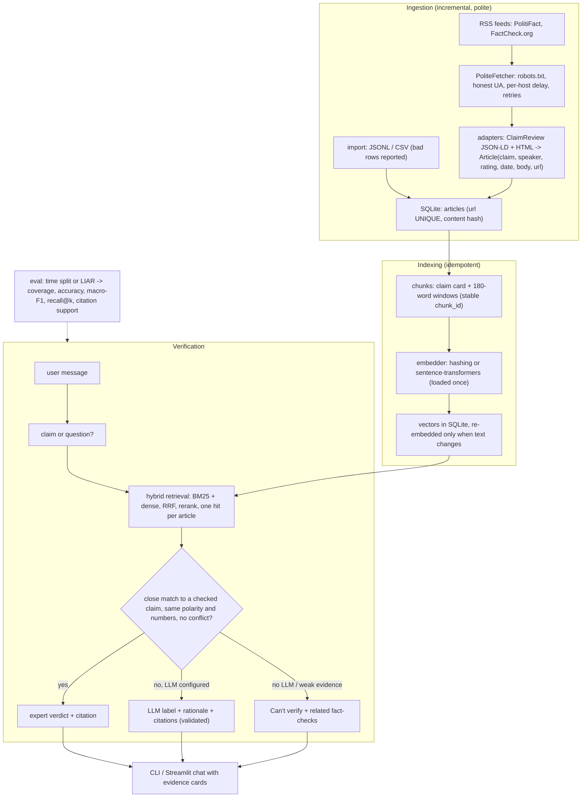

# truthtrace

A RAG fact-checker grounded in FactCheck.org and PolitiFact. It finds the professional fact-checks that address a claim, returns their verdict with citations, and says "can't verify" when the evidence doesn't support an answer.

[](https://github.com/KrishnaAnnavaram/truthtrace/actions/workflows/ci.yml)


## Features

- **Structured fact-checks, not just prose.** For each fact-check it stores the claim, the speaker, the source's rating, the publication date, the full body and the URL. PolitiFact pages are read from their schema.org `ClaimReview` data, with an HTML fallback.
- **Expert verdict first.** When your claim closely matches a fact-checked claim, you get that fact-checker's rating and a link. Guards stop the rating from carrying over when one statement is negated and the other isn't, or when the numbers differ.
- **Grounded LLM judgement (optional).** Gemini or OpenAI returns JSON `{label, rationale, citations}` on a fixed scale. Off-scale labels, uncited verdicts and citations to evidence that doesn't exist are rejected, and the system abstains instead.
- **Abstains honestly.** Weak evidence, disagreeing fact-checks or invalid model output all lead to "Can't verify" plus the related fact-checks. It never shows percentages of truth.
- **Hybrid retrieval.** BM25 plus dense vectors, combined with reciprocal rank fusion, then reranked (lexical or cross-encoder). Results are one per article and can be filtered by date. Long articles are chunked into overlapping 180-word windows, so nothing is cut off at the encoder limit.
- **Idempotent storage.** SQLite in WAL mode. Articles upsert by URL with a content hash, and chunks upsert by a stable chunk id, so re-running ingestion or indexing never creates duplicates. There are no pickle files.
- **Polite ingestion.** It discovers articles through RSS, respects robots.txt, sends an honest User-Agent, waits between requests to the same host, retries with backoff, fetches only new URLs, caps pages per run, and runs at most once per hour (daily by default).
- **Evaluation built in.** A time-split test set (no leakage) or LIAR TSV input, with coverage, accuracy, macro-F1, recall@k and citation support reported.
- **Works offline.** The core uses only the standard library. `truthtrace demo` runs on bundled *fictional* fact-checks with a deterministic fake LLM.

## Architecture



## Quickstart

```bash
python -m venv .venv && . .venv/Scripts/activate        # Windows; use .venv/bin/activate on Linux/macOS
pip install -e ".[dev]"

# 1. Offline demo on fictional fact-checks (no keys, no network)
truthtrace demo
truthtrace demo "The Riverton bridge will be closed for two years"

# 2. Real data
cp .env.example .env                                    # optional: LLM provider and key, embedder
pip install -e ".[embeddings,gemini,dotenv]"            # or [openai]; embeddings are optional
truthtrace ingest --max-items 30                        # new fact-checks from the RSS feeds
truthtrace check "Crime is at an all-time high"
truthtrace eval --cutoff 2025-01-01                     # time-split evaluation on stored claims

# 3. Chat UI
pip install -e ".[ui]"
truthtrace ui
```

Other commands: `truthtrace import file.jsonl|file.csv` loads an export, `truthtrace index` re-syncs chunks and vectors (safe to repeat, and required after changing the embedder), `truthtrace stats` shows database counts, and `truthtrace ingest --every 24` keeps ingesting on a schedule (the minimum is 1 hour). To use a different database, put `--db PATH` before the subcommand.

## Configuration

| Variable | Default | Meaning |
|---|---|---|
| `TRUTHTRACE_LLM_PROVIDER` | `none` | `none` (verdicts only from matched fact-checks), `fake`, `gemini`, `openai` |
| `TRUTHTRACE_LLM_MODEL` | per provider | `gemini-2.0-flash` / `gpt-4o-mini` |
| `GOOGLE_API_KEY` / `OPENAI_API_KEY` | none | Required only for that provider; never logged or printed |
| `TRUTHTRACE_EMBEDDER` | `hashing` | `hashing` (no dependencies) or `sentence-transformers:BAAI/bge-small-en-v1.5` |
| `TRUTHTRACE_RERANKER` | `lexical` | `lexical` or `cross-encoder:cross-encoder/ms-marco-MiniLM-L-6-v2` |
| `TRUTHTRACE_DB_PATH` | `data/truthtrace.db` | SQLite database (git-ignored) |
| `TRUTHTRACE_TOP_K` | `5` | Evidence items per answer |
| `TRUTHTRACE_MATCH_THRESHOLD` | `0.6` | Reranker score needed to reuse a fact-checker's rating directly |
| `TRUTHTRACE_ABSTAIN_THRESHOLD` | `0.2` | Below this relevance the tool abstains |
| `TRUTHTRACE_CHUNK_WORDS` / `TRUTHTRACE_CHUNK_OVERLAP` | `180` / `40` | Body chunking |
| `TRUTHTRACE_CONTACT_URL` | project URL | Included in the User-Agent so site operators can reach you |
| `TRUTHTRACE_REQUEST_DELAY` | `5` | Seconds between requests to the same host (minimum 2) |
| `TRUTHTRACE_MAX_ITEMS` | `50` | Maximum article pages fetched per ingestion run |
| `TRUTHTRACE_INGEST_INTERVAL_HOURS` | `24` | Default schedule (minimum 1) |
| `TRUTHTRACE_HISTORY_TURNS` | `4` | Chat turns of context kept for follow-up questions |
| `TRUTHTRACE_LOG_LEVEL` | `INFO` | Logging level |

The thresholds are tuned for the lexical reranker. Re-tune them with `truthtrace eval` if you switch to a cross-encoder.

## Project structure

```
src/truthtrace/
  config.py          Settings from env (.env optional), validation, honest User-Agent
  models.py          Article, Evidence, VerificationResult
  labels.py          fixed verdict scale + mapping of source ratings (no percentages)
  dates.py, text.py  date parsing; tokenising, negation/number detection, chunking, hashing
  sources/           http.py (PoliteFetcher), rss.py, html.py (JSON-LD, stdlib HTML parsing),
                     politifact.py, factcheck_org.py, records.py (JSONL/CSV import)
  storage.py         SQLite store: upsert by URL, chunks by id, WAL, transactions
  indexing.py        chunking + embedding sync (idempotent)
  embeddings.py      hashing / sentence-transformers embedders (cached)
  bm25.py            pure-Python BM25
  rerank.py          lexical / cross-encoder rerankers
  retrieval.py       hybrid retrieval with RRF, date filters, per-article dedupe
  llm.py             Gemini / OpenAI / fake providers (JSON output, temperature 0)
  verify.py          claim detection, matched-verdict guards, LLM validation, abstention
  chat.py            bounded per-session history
  ingest.py          incremental ingestion, file import, scheduler
  evaluation.py      time split, LIAR loader, metrics
  cli.py             `truthtrace` command
  ui/streamlit_app.py  chat UI with evidence cards
  prompts/           versioned prompt templates
  demo/factchecks.jsonl  fictional fact-checks for the offline demo
tests/               unit + end-to-end tests (no network, no keys)
```

## How it works

1. **Ingest.** Feed URLs are fetched politely and filtered to fact-check article URLs. URLs already in the database are skipped. Each page is parsed into an `Article`. PolitiFact's `ClaimReview` gives the claim, speaker, rating (`alternateName`, for example "pants-fire") and date. FactCheck.org articles keep their full body and usually have no rating. Articles are upserted by URL: an unchanged hash means no write.
2. **Index.** Each article becomes a "claim card" chunk (title, claim, speaker, rating, summary) plus overlapping body windows, each prefixed with the title. Only new or changed chunks are re-embedded.
3. **Retrieve.** BM25 and dense rankings are combined with reciprocal rank fusion. The best chunk per article wins, optional date windows are applied, and candidates are reranked against both the passage and the checked claim.
4. **Decide.** Messages like "Is it true that..." or "Fact check: ..." are treated as claims, and other questions are answered from evidence. A claim gets an expert verdict only when a checked claim matches closely, with the same polarity and numbers, and closely matching fact-checks don't disagree. Otherwise a configured LLM judges with citations that are then validated. If none of that is possible, the tool abstains.
5. **Evaluate.** `truthtrace eval --cutoff DATE` tests on labelled claims published on or after `DATE`, retrieving only from articles published before it. It reports coverage (non-abstained share), exact and coarse (supported/mixed/refuted) accuracy, coarse macro-F1, overall accuracy that counts abstentions as wrong, recall@k when relevant URLs are known, and citation support.

## Testing

```bash
pip install -e ".[dev]"
pytest -q
```

The tests use synthetic HTML, RSS and records written for this repo, a fake HTTP transport, a stub LLM and the hashing embedder, so they need no network and no keys. Most tests target a specific failure mode of an earlier prototype: duplicate re-indexing, dropped verdicts, made-up confidence, missing evaluation, mismatched date columns, truncated embeddings, per-query model loading, the query duplicated in the prompt, indexer crash paths, unsafe storage, aggressive scraping, and commands that didn't match the docs. CI runs `pytest` on Python 3.11 for every push.

## Roadmap

- [x] **M1:** source adapters with verdict fields (ClaimReview) and an SQLite store with URL upserts
- [x] **M2:** idempotent chunked index with hybrid BM25 + dense retrieval and reranking
- [x] **M3:** evaluation harness (time split, LIAR loader, coverage, accuracy, macro-F1, recall@k, citation support) and a nearest-claim baseline
- [x] **M4:** LLM verifier with validated citations and abstention
- [x] **M5:** Streamlit chat UI with evidence cards
- [x] **M6:** scheduled incremental ingestion (hourly minimum, daily default)
- [ ] NLI model for claim-to-evidence entailment as a second opinion next to the LLM
- [ ] Publish baseline numbers on a held-out PolitiFact time split and on LIAR
- [ ] Postgres/pgvector backend and a FastAPI endpoint for multi-user deployments
- [ ] Sitemap-based backfill with per-site crawl budgets and monitoring of ingestion health

## Limitations and responsible use

- **This is not an oracle.** Verdicts come from the linked fact-checkers or from an LLM reading their articles. A matched rating applies to the *checked* statement, which may differ in wording, time or context from yours. Always read the cited article, and treat "Can't verify" as "no fact-check found", not as "true".
- **Coverage is limited** to what PolitiFact and FactCheck.org have checked. Recent claims usually have no fact-check yet. Lexical matching (the default) misses paraphrases, so use a sentence-transformers embedder and cross-encoder for better recall.
- **Bias and selection.** Fact-checkers choose what to check, so the corpus is not a random sample of political statements. Don't read aggregate numbers as measures of any person's or party's honesty.
- **Copyright and terms of use.** Articles belong to their publishers. Scraped text stays in your local, git-ignored database and is shown only as short evidence snippets with links. Check each site's terms of use and robots.txt before you ingest, keep crawl rates low, and don't redistribute the database. Use the `import` command for data you are licensed to use.
- **Demo data is fictional.** `demo/factchecks.jsonl` describes made-up places and people, written only to exercise the pipeline.
- **LLM output** is constrained to cite evidence and validated, but it can still misread an article. The default configuration (`none`) uses no LLM at all.

## License

[MIT](LICENSE) © 2026 Krishna Annavaram
